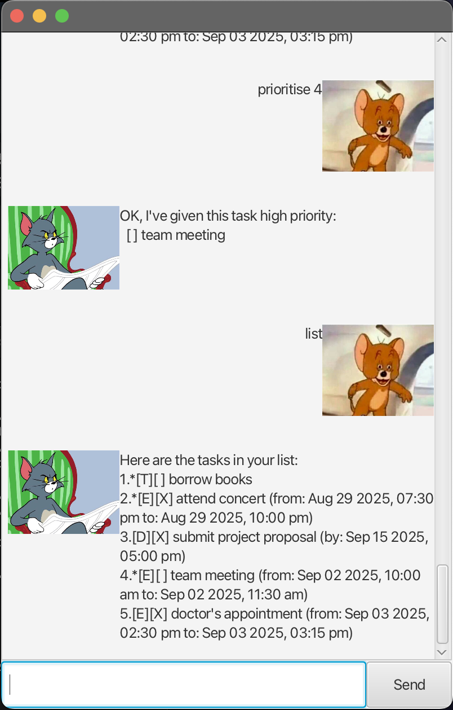

# Tom User Guide



Behold, the world's worst chatbot. 

Reads any existing tasks from `data/tom.txt` and saves new tasks (and updates to them) to the same text file. 
Directory and text file will be created if they don't already exist.
Tasks are saved in format
```
[PRIORITY] TASK_TYPE | MARKED | DESCRIPTION | [DATES]
```
where `PRIORITY` is either empty (low priority) or an asterisk (high priority), `TASK_TYPE` is the first 
letter of the respective task names, and `MARKED` is either 1 (marked) or 0 (unmarked). `DATES` are the
deadline, start date/time and end date/time when applicable.

## Adding Todo items: `todo`
Adds a Todo item (i.e. item with no associated dates) to the list. 

Format: `todo DESCRIPTION`

Example: `todo borrow book`

## Adding Deadlines: `deadline`
Adds a Deadline item to the list. `DEADLINE` should be in "yyyy-MM-dd HHmm" format.

Format: `deadline DESCRIPTION /by DEADLINE`

Example: `deadline submit project proposal /by 2025-09-15 1700`

## Adding Events: `event`
Adds an Event item to the list. `START` and `END` should be in "yyyy-MM-dd HHmm" format.

Format: `deadline DESCRIPTION /from START /to END`

Example: `event attend concert /from 2025-08-29 1930 /to 2025-08-29 2200`

## Marking tasks: `mark`
Marks the `INDEX`-th task on the list as done.

Format: `mark INDEX`

## Unmarking tasks: `unmark`
Unmarks the `INDEX`-th task on the list as undone.

Format: `unmark INDEX`

## Prioritising a task: `prioritise`
Prioritises the `INDEX`-th task on the list.

Format: `prioritise INDEX`

## Deleting a task: `delete`
Deletes the `INDEX`-th task on the list.

Format: `delete INDEX`

## Finding a task: `find`
Shows all tasks in the list with description containing `KEYWORD`. Search is case-sensitive.

Format: `find KEYWORD`

Example: `find doctor` returns all tasks with description containing the word "doctor".

## Listing all tasks: `list`
Shows a list of all tasks that are currently in the todo list.

Format: `list`

## Closing the chatbot: `bye`
Closes the GUI and stops the app after 3 seconds.

Format: `bye`
